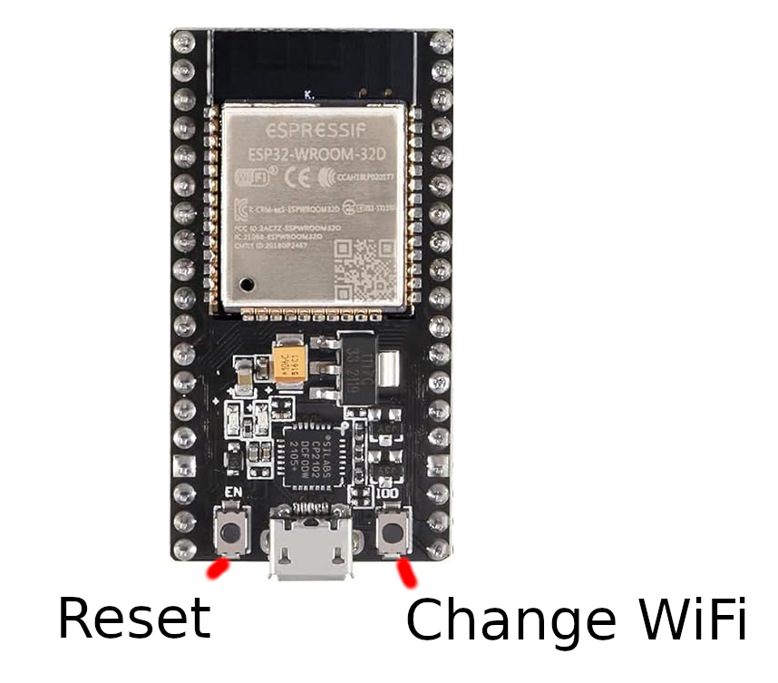
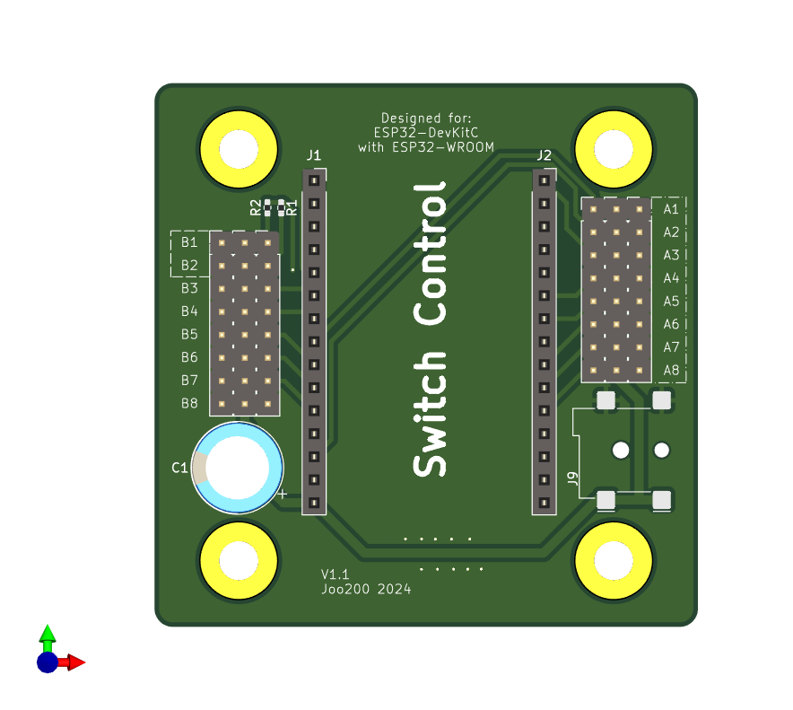
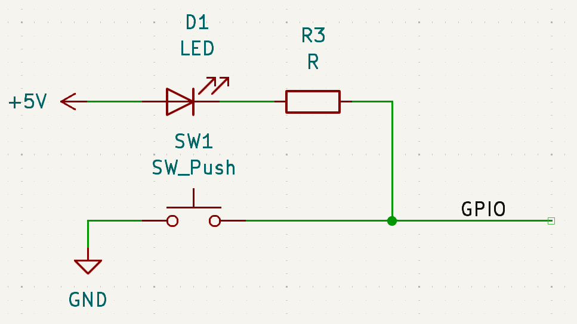

# Switch-Control Usage Guide

## WiFi Configuration

Switch-Control utilizes the ESP32's WiFi module and can be operated in the following modes:

1. **Access Point (AP):** The device creates its own WiFi network.
2. **WiFi Client (Station):** The device connects to an existing WiFi network.
3. **Disabled:** WiFi functionality is turned off.

### Changing the WiFi Mode

The mode can be switched by:

* **Hardware:** Press and hold the **BOOT** button on the ESP32 board for more than 2 seconds.
* **Software:** Update the settings via the web interface.

### Access Point Mode

By default, Switch-Control starts as an Access Point with these credentials:
* **SSID:** `switch-control`
* **Password:** `emergency`

Once connected to the Access Point, the web interface is accessible at [http://192.168.4.1](http://192.168.4.1).

### WiFi Client Mode

In Client mode, Switch-Control connects to your local WiFi network. These settings are configurable via the web interface, supporting both **DHCP** and **Static IP** addresses.

## GPIO Configuration

The ESP32 DevKit is designed to be mounted on a PCB with the following layout:

> **Note:** Always save changes to the current channel before navigating to or configuring another one.

### Servo Configuration

Servos can be connected directly to the pin headers. They are configurable via the web interface using pins **A1 through A8**.

The data pin has to be towards the center of the board.

The following parameters can be adjusted:

* **Left Position**
* **Right Position**
* **Overdraw Position (Left)**
* **Overdraw Position (Right)**
* **Overdraw Duration**

The web interface provides options to test the Left and Right positions immediately.

### Button Configuration

Buttons with integrated LED feedback can be connected to the pin headers and configured via the web interface on any available pin.

#### Technical Specifications

To read button presses and drive the LED status simultaneously on a single pin, the ESP32 performs the following sequence:

1. Configures the pin as an **Input**.
2. Reads the current physical state of the button.
3. Reconfigures the pin as an **Output**.
4. Updates the LED state by driving the GPIO (connecting to GND or High-Z).

The button and LED should follow this wiring layout:

Connect GND, 5V and GPIO to the respective pins on the board. Make sure that the GPIO pin is towards the center of the board.

#### Configuring Button Actions

Button behaviors are defined in the web interface. Each button can trigger multiple actions, allowing it to toggle or change the direction of other configured pins (e.g., controlling a servo).

## Demo Application

A demo version of the web application is available for testing without ESP32 hardware.

### Online Demo
The demo is automatically deployed to GitHub Pages and can be accessed at:
`https://joo200.github.io/Switch-Control/`

